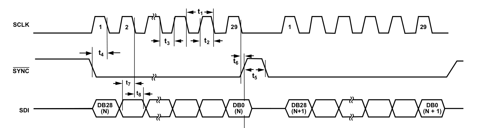
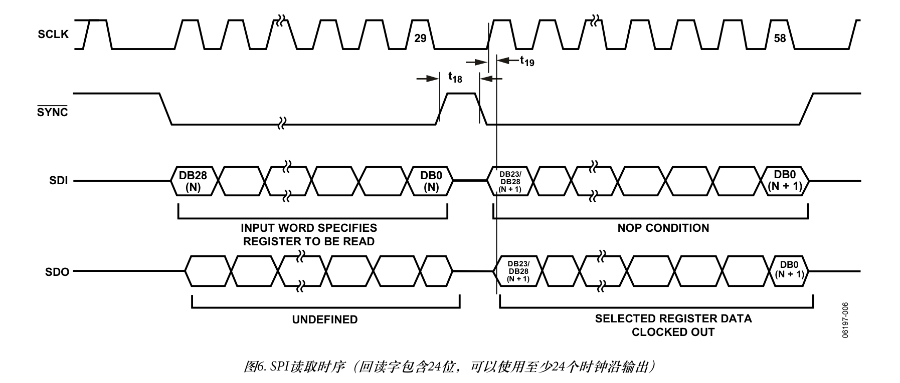
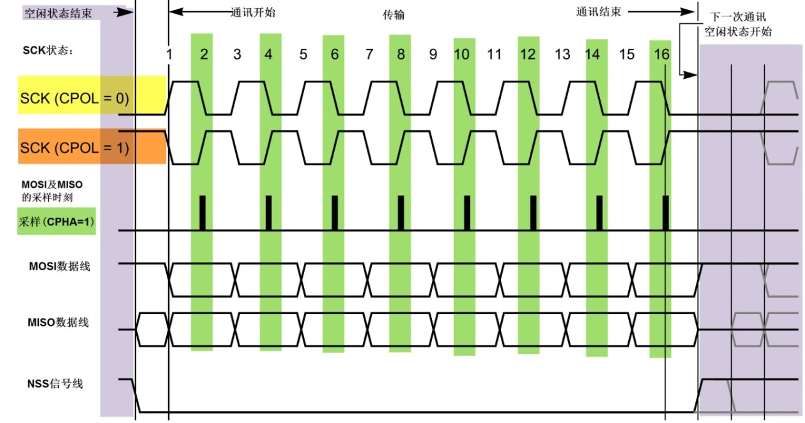
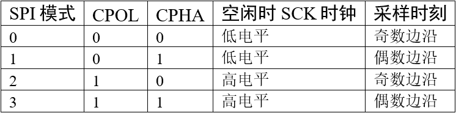
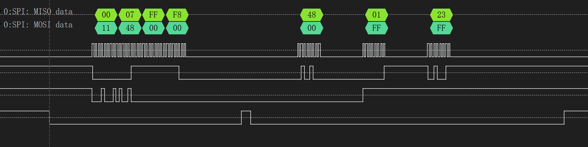
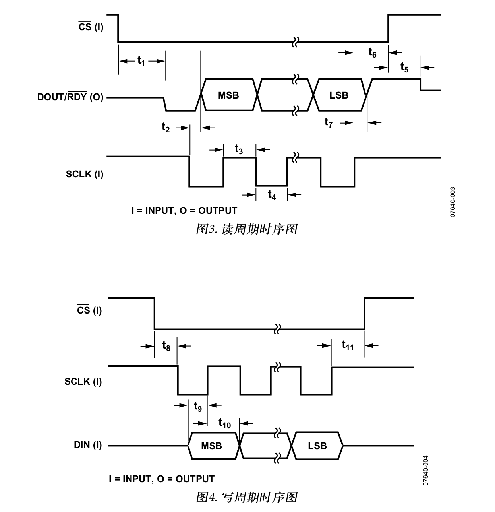
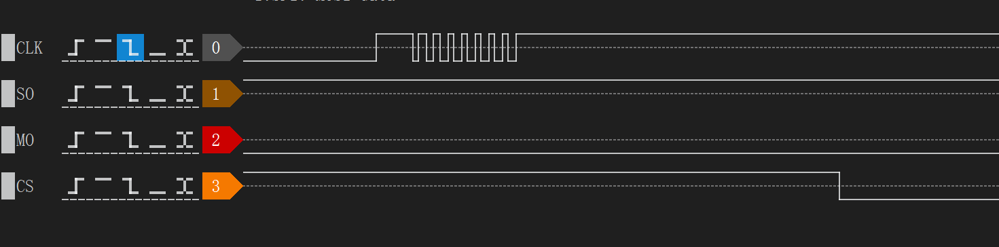

## AD5522 通讯

SPI 外设通讯设置

AD5522 write



AD5522 read



SPI Mode





https://doc.embedfire.com/mcu/stm32/f103badao/std/zh/latest/book/SPI.html

根据时序要求可知，spi外设参数为

CPOL = 0

CPHA = 1

FIRSTBIT_MSB


这是STM32F103 SPI 的设置结果，其中通讯速率可自由修改。

```cpp
  hspi1.Instance = SPI1;
  hspi1.Init.Mode = SPI_MODE_MASTER;
  hspi1.Init.Direction = SPI_DIRECTION_2LINES;
  hspi1.Init.DataSize = SPI_DATASIZE_8BIT;
  hspi1.Init.CLKPolarity = SPI_POLARITY_LOW;
  hspi1.Init.CLKPhase = SPI_PHASE_2EDGE;
  hspi1.Init.NSS = SPI_NSS_SOFT;
  hspi1.Init.BaudRatePrescaler = SPI_BAUDRATEPRESCALER_16;
  hspi1.Init.FirstBit = SPI_FIRSTBIT_MSB;
  hspi1.Init.TIMode = SPI_TIMODE_DISABLE;
  hspi1.Init.CRCCalculation = SPI_CRCCALCULATION_DISABLE;
  hspi1.Init.CRCPolynomial = 10;
```

寄存器写函数为：

```cpp
// 大小端转换
uint32_t toLittleEndian(uint32_t value) {
    return ((value >> 24) & 0x000000FF) | // 移动到低位
           ((value >> 8) & 0x0000FF00) |  // 移动到中间
           ((value << 8) & 0x00FF0000) |  // 移动到高位
           ((value << 24) & 0xFF000000);  // 移动到最高位
}

int AD5522_WriteReg(handle_AD5522* h,__IO uint32_t cmd)
{
	// cmd = cmd<<3; 不需要移位
	uint32_t cmd_l = toLittleEndian(cmd);
	HAL_GPIO_WritePin(SMU_CS_GPIO_Port,SMU_CS_Pin,0);
	SMU_SPI_CS_DELAY
	int resp = HAL_SPI_Transmit(h->hspi,(uint8_t*)&cmd_l,4,1000);
	SMU_SPI_CS_DELAY
	HAL_GPIO_WritePin(SMU_CS_GPIO_Port,SMU_CS_Pin,1);
	return resp;
}

int AD5522_ReadReg(handle_AD5522* h,__IO uint32_t cmd, __IO uint32_t* rst)
{
	uint32_t cmd_l = toLittleEndian(cmd);
	uint32_t cmd_nop = toLittleEndian(0x00FFFFFF); // NOP
	uint32_t rst_l = 0;
	HAL_GPIO_WritePin(SMU_CS_GPIO_Port,SMU_CS_Pin,0);
	SMU_SPI_CS_DELAY
	HAL_SPI_Transmit(h->hspi,(uint8_t*)&cmd_l,4,1000);
	SMU_SPI_CS_DELAY
	HAL_GPIO_WritePin(SMU_CS_GPIO_Port,SMU_CS_Pin,1);
	SMU_SPI_CS_DELAY
	HAL_GPIO_WritePin(SMU_CS_GPIO_Port,SMU_CS_Pin,0);
	SMU_SPI_CS_DELAY
	int resp=HAL_SPI_TransmitReceive(h->hspi,(uint8_t*)&cmd_nop,(uint8_t*)&rst_l,4,1000);
	SMU_SPI_CS_DELAY
	HAL_GPIO_WritePin(SMU_CS_GPIO_Port,SMU_CS_Pin,1);

	*rst = toLittleEndian(rst_l);

	*rst=*rst>>8; //shift 32bit SPI to 24 bit readout
	return resp;
}
```

说明：

1.因为将 `hspi1.Init.DataSize = SPI_DATASIZE_8BIT;` 故需要做大小端转换。例如 cmd 为 0x12345678 为了让函数 `HAL_SPI_Transmit(h->hspi,(uint8_t*)&cmd_l,4,1000);` 按 12 34 56 78 的顺序输出，需要将 cmd_l 的内容调整为 78 56 34 12。

2.(Rev. F | Page 42 of 64)处有这样一段说明：`移位寄存器可以接受更长的字（例如，32位字），按SYNC帧同步，但数据应始终位于第29个LSB位。` 一开始我理解为需要将cmd右移三位即 spi 输出的第一个位为读写控制位。实际测试并不需要这样操作。

3. 写操作，NOP 可以是 0x00FFFFFF HAL_SPI_TransmitReceive 写入 4个字节。或者 0xFFFFFF HAL_SPI_TransmitReceive 写入 3个字节


下图是逻辑分析仪采集 PMU_DACREG_ADDR_FIN_5UA_M 寄存器读取的过程。

```cpp
AD5522_WriteReg(&h_PMU,PMU_CH_0|PMU_DACREG_ADDR_FIN_5UA_M|0x0123);

uint32_t buf=0;
AD5522_ReadReg(&h_PMU, PMU_REG_RD|PMU_CH_0|PMU_DACREG_ADDR_FIN_5UA_M, &buf);
```




## AD7190 通讯



时序和 AD5522 不太一样，应该是：

CPOL = 1

CPHA = 1

故需要单独写一个 SPI 外设的初始化函数，仅修改 MX_SPI1_Init 中的：

```c
hspi1.Init.CLKPolarity = SPI_POLARITY_HIGH;
```

SPI CLK 速率最高: 周期(100ns + 100ns) 频率(5MHz)

当前频率 4.5Mhz

## 同时与 AD5522 和 AD7190 通讯

`AD7190_SPI1_Init();` 函数完成后 sclk 的电平还是为低，此时并不能直接和 AD7190 通讯，需要发送一次数据将 sclk 的电平转为高以后再去和 AD7190 通讯

```c
// 将 clk 的电平切换到 High
void SPI_Send_Nop() {
  const uint8_t nop_data = 0;
  HAL_SPI_Transmit(&hspi1, &nop_data, 1, 1000);
}
```



## 串口 DMA 接收功能

想要使用`空闲检测`功能，则需要启用 DMA 接收中断，也要启动串口中断。
