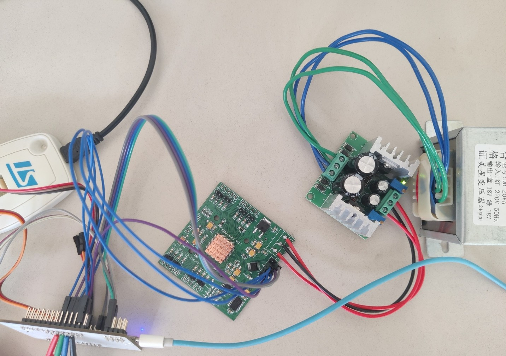
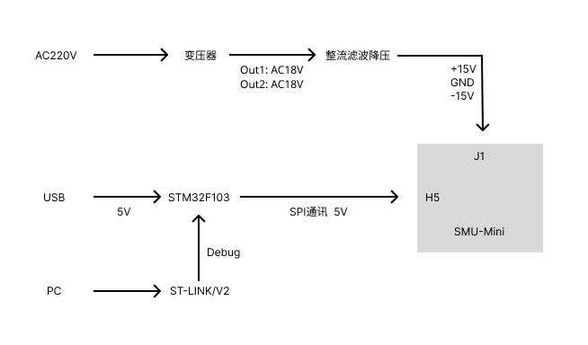
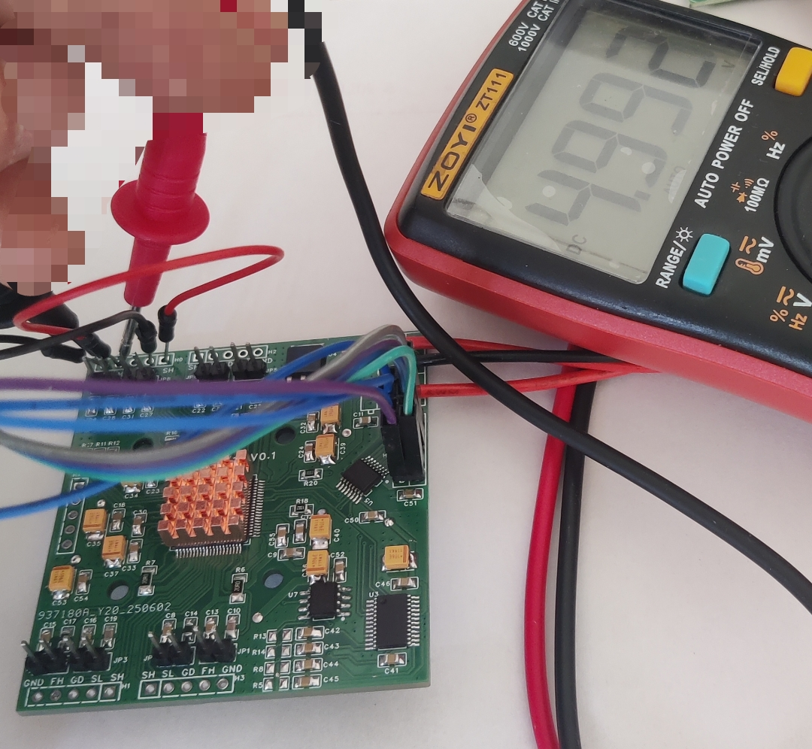

## 介绍

Quad-SMU 四通道参数测量单元

功能：

电压驱动(FV)、电流驱动(FI)、高阻输出(FN)、测量电压(MV)、测量电流(MI) 

详情参考 AD5522 芯片手册

## 方案

### 整体框架

## 硬件

SMU-Mini原理图：Document\SCH_Schematic1_2025-06-07.pdf

在 [Dave Erickson](https://www.djerickson.com/quad-smu/) 的基础上修改了 ADC 采样和通讯隔离芯片。

### 改动：

STM32 开发板：

MOSI（PA6） 通过一个 1k 的电阻连接到 ADC_READY_Pin（PB11）

## 软件

开发环境：`Windows` `VScode` `Stm32 VS Code Extension` 安装方式请参考 [st.com](https://www.st.com/content/st_com/en/campaigns/stm32-vs-code-extension-z11.html)

依赖的软件有：STM32CubeMX STM32CubeCLT

在一开始编译完项目后，F5 调试提示错误，检测不到硬件。为了确定是硬件问题还是环境为设置正确，我又安装了 STM32CubeProgrammer 帮助我确定是硬件原因，而非环境设置问题。当然 Keil 也可以。

在 Stm32 VS Code Extension 打开 Launch STM32CubeMX 修改 smu-mini.ioc 选择 CMake 方式重新生成项目工程后，需要在 cmake/stm32cubemx/CMakeLists.txt 中增加自行添加的 .c 源文件。 如 `${CMAKE_SOURCE_DIR}/Core/Src/ad5522.c`

## 进度

### 已完成

* Stm32 和 AD5522 通讯， 将 AD5522 的 CH_0 CH_1 设置为 FVMI 模式输出电压5V。反馈 SL 接 GND，SH 接 FH。测量 GND 和 FH 之间的电压（未校准）。

* Stm32 和 AD7190 通讯，可以读取到 AD7190 AIN1 对 AINCOM 的 AD 值。

* 依次与 AD5522 和 AD7190 两个芯片通讯

### 待开发

踩坑记录 Document/README_CN.md

* 完善与 AD5522 的通讯

* 完善与 AD7190 的通讯

* 提高与上面的两个芯片通讯效率

* 与上位机通讯

* 校准

## 感谢

https://www.djerickson.com/quad-smu/

https://github.com/zifangzhao/PMU_controller/blob/H7A3/Core/Src/AD5522.c

https://github.com/msthrax/AD7190/tree/master