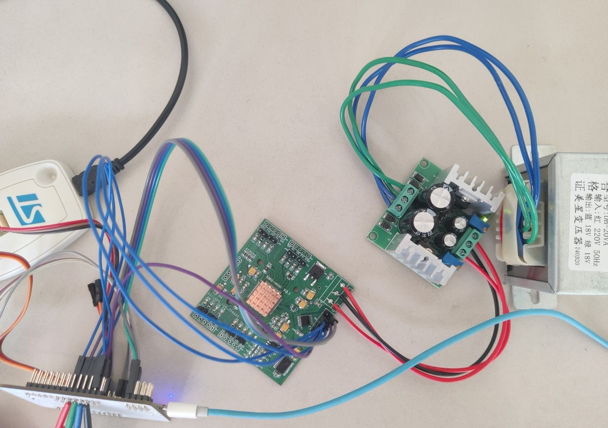
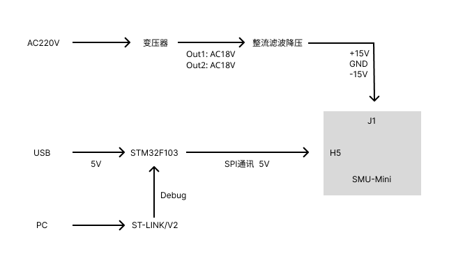
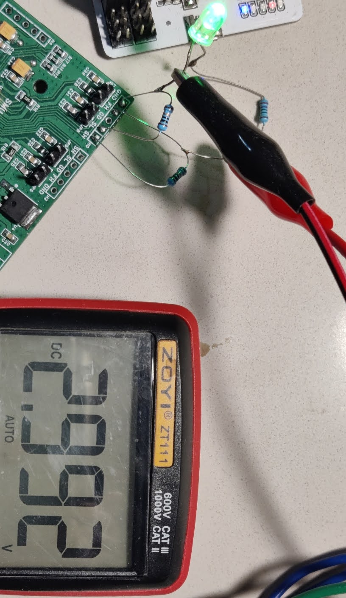

## 介绍

Quad-SMU 四通道参数测量单元

问题：

ad7190的MISO引脚复用为Ready信号，所以每次读取结果spi总线都会被Ready信号占用。如果通过spi总线轮询ad7190，又要因为ad7190和ad5522的spi参数不一样又要不停的改变spi总线参数。所以最好的办法是再加一个隔离芯片和spi总线，两个芯片都有单独的spi总线互不影响。

ADC采样速度最高4.8kHz，如果4通道轮询采样，由于需要建立时间单个通道采样率只能到400Hz

用qt写一个上位机软件，需要投入较多精力也不够灵活。

下个版本：

参考项目 https://gitlab.com/Chips4Makers/snowwhite/-/tree/master/designs/NLNet018TV/testing/AD5522/RaspberryPi?ref_type=heads 用树莓派做主控直接通过板载io与芯片通讯。jupyter 环境跑Python 代码，还实现校准功能。项目中的注视说部分功能稍慢想通过c来重写这部分功能。没有看到动态修改量程相关的功能(还是说并没有这种需求？)

硬件调整：直接参考 ad5522 官方开发板原理图；主控改为stm32；通过USB和上位机通讯，将通讯引脚引出方便使用其他控制器。stm32 主要是扫描功能的时候不依赖上位机。到时看有没有必要同时支持spi指令透传和scpi标准仪器指令。

---

功能：

电压驱动(FV)、电流驱动(FI)、高阻输出(FN)、测量电压(MV)、测量电流(MI) 

详情参考 AD5522 芯片手册

## 方案

### 整体框架

## 硬件

SMU-Mini原理图：Document\SCH_Schematic1_2025-06-07.pdf

在 [Dave Erickson](https://www.djerickson.com/quad-smu/) 的基础上修改了 ADC 采样和通讯隔离芯片。

### 改动：

STM32 开发板：

MOSI（PA6） 通过一个 1k 的电阻连接到 ADC_READY_Pin（PB11）

## 软件

开发环境：`Windows` `VScode` `Stm32 VS Code Extension` 安装方式请参考 [st.com](https://www.st.com/content/st_com/en/campaigns/stm32-vs-code-extension-z11.html)

或者 [Linux VScode](https://yyii-site.github.io/2026/07/29/%E5%9C%A8Archlinux%E4%B8%AD%E9%80%9A%E8%BF%87VSCode%E5%BC%80%E5%8F%91STM32-%E6%9E%81%E7%AE%80%E7%89%88/)

依赖的软件有：STM32CubeMX STM32CubeCLT

在一开始编译完项目后，F5 调试提示错误，检测不到硬件。为了确定是硬件问题还是环境为设置正确，我又安装了 STM32CubeProgrammer 帮助我确定是硬件原因，而非环境设置问题。当然 Keil 也可以。

在 Stm32 VS Code Extension 打开 Launch STM32CubeMX 修改 smu-mini.ioc 选择 CMake 方式重新生成项目工程后，需要在 cmake/stm32cubemx/CMakeLists.txt 中增加自行添加的 .c 源文件。 如 `${CMAKE_SOURCE_DIR}/Core/Src/ad5522.c`

## 进度

### 已完成

* Stm32 和 AD7190 通讯，可以读取到 AD7190 AIN1 对 AINCOM 的 AD 值。

* 依次与 AD5522 和 AD7190 两个芯片通讯

* 串口 DMA 接收功能

* 接入 SCPI 库，指令接收与返回

SCPI 库的 libscpi/inc/scpi/config.h 使用 `#define SCPIDEFINE_doubleToStr(v, s, l) snprintf((s), (l), "%.15lg", (v))` 做浮点转换，但生成的项目工程默认禁用浮点功能，需要修改文件cmake/gcc-arm-none-eabi.cmake ，增加 ` -u_printf_float`. 编译后的 ROM 增加了 4912B.

`set(CMAKE_C_FLAGS "${CMAKE_C_FLAGS} -Wall -Wextra -Wpedantic -fdata-sections -ffunction-sections -u_printf_float")`

增加自定义 SCPI 指令控制 AD5522 芯片

* SCPI 通讯任务和 AD7190 任务均会使用 SPI1，所以使用互斥信号量，保护共享资源。

* 可在[上位机软件](https://github.com/yyii-site/smu-mini-qml)通过SCPI指令设置 CH0 的目标电压，读取 AD7190 的测量值

### 待开发

踩坑记录 Document/README_CN.md

* 完善与 AD5522 的通讯

* 完善与 AD7190 的通讯

* 提高与上面的两个芯片通讯效率

* 完善与上位机通讯

* 校准

* 电压零点偏差 2.5V 的问题

## 感谢

https://www.djerickson.com/quad-smu/

https://github.com/zifangzhao/PMU_controller/blob/H7A3/Core/Src/AD5522.c

https://github.com/msthrax/AD7190/tree/master

[一个严谨的STM32串口DMA发送&接收（1.5Mbps波特率）机制](https://zhuanlan.zhihu.com/p/512533089)

https://github.com/j123b567/scpi-parser